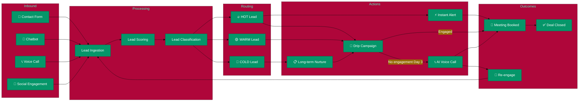

```mermaid
%%{init: {'theme': 'base', 'themeVariables': {'primaryColor': '#059669', 'primaryTextColor': '#fff'}}}%%

flowchart LR
    subgraph "Inbound"
        F["📝 Contact Form"]
        C["💬 Chatbot"]
        V["📞 Voice Call"]
        S["📱 Social Engagement"]
    end

    subgraph "Processing"
        LI["Lead Ingestion"]
        LS["Lead Scoring"]
        LC["Lead Classification"]
    end

    subgraph "Routing"
        HOT["🔥 HOT Lead"]
        WARM["🟡 WARM Lead"]
        COLD["🔵 COLD Lead"]
    end

    subgraph "Actions"
        AL["⚡ Instant Alert"]
        DR["📧 Drip Campaign"]
        VC["📞 AI Voice Call"]
        LT["📋 Long-term Nurture"]
    end

    subgraph "Outcomes"
        MT["📅 Meeting Booked"]
        CL["✅ Deal Closed"]
        RE["🔄 Re-engage"]
    end

    F --> LI
    C --> LI
    V --> LI
    S --> LI

    LI --> LS
    LS --> LC

    LC --> HOT
    LC --> WARM
    LC --> COLD

    HOT --> AL
    HOT --> DR
    WARM --> DR
    COLD --> LT

    AL --> MT
    DR -->|"No engagement Day 3"| VC
    DR -->|"Engaged"| MT
    VC --> MT
    VC --> RE
    LT --> DR

    MT --> CL
    RE --> LI
```