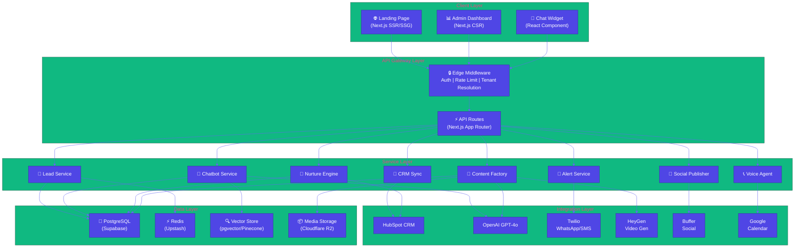

```mermaid
%%{init: {'theme': 'base', 'themeVariables': {'primaryColor': '#4F46E5', 'primaryTextColor': '#fff', 'primaryBorderColor': '#3730A3', 'lineColor': '#6366F1', 'secondaryColor': '#F59E0B', 'tertiaryColor': '#10B981'}}}%%

graph TB
    subgraph "Client Layer"
        LP["🌐 Landing Page<br/>(Next.js SSR/SSG)"]
        AD["📊 Admin Dashboard<br/>(Next.js CSR)"]
        CW["💬 Chat Widget<br/>(React Component)"]
    end

    subgraph "API Gateway Layer"
        MW["🔒 Edge Middleware<br/>Auth | Rate Limit | Tenant Resolution"]
        API["⚡ API Routes<br/>(Next.js App Router)"]
    end

    subgraph "Service Layer"
        LS["👤 Lead Service"]
        CS["🤖 Chatbot Service"]
        CRM["🔄 CRM Sync"]
        AS["🔔 Alert Service"]
        NE["📧 Nurture Engine"]
        VA["📞 Voice Agent"]
        CF["🎨 Content Factory"]
        SP["📱 Social Publisher"]
    end

    subgraph "Integration Layer"
        HS["HubSpot CRM"]
        OA["OpenAI GPT-4o"]
        TW["Twilio<br/>WhatsApp/SMS"]
        HG["HeyGen<br/>Video Gen"]
        BF["Buffer<br/>Social"]
        GC["Google<br/>Calendar"]
    end

    subgraph "Data Layer"
        PG["🐘 PostgreSQL<br/>(Supabase)"]
        RD["⚡ Redis<br/>(Upstash)"]
        VC["🔍 Vector Store<br/>(pgvector/Pinecone)"]
        S3["📦 Media Storage<br/>(Cloudflare R2)"]
    end

    LP --> MW
    AD --> MW
    CW --> MW
    MW --> API

    API --> LS
    API --> CS
    API --> CRM
    API --> AS
    API --> NE
    API --> VA
    API --> CF
    API --> SP

    LS --> PG
    CS --> OA
    CS --> VC
    CRM --> HS
    AS --> TW
    NE --> HS
    VA --> GC
    CF --> OA
    CF --> HG
    SP --> BF

    LS --> RD
    CS --> PG
    NE --> PG
    CF --> PG
    CF --> S3
```