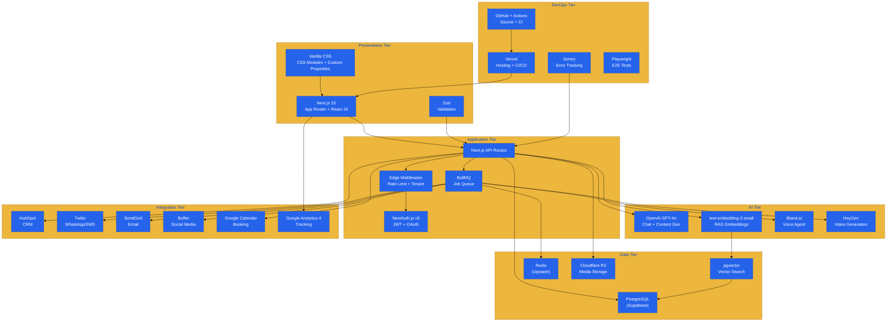

```mermaid
%%{init: {'theme': 'base', 'themeVariables': {'primaryColor': '#2563EB', 'primaryTextColor': '#fff'}}}%%

graph TB
    subgraph "Presentation Tier"
        N["Next.js 15<br/>App Router + React 19"]
        CSS["Vanilla CSS<br/>CSS Modules + Custom Properties"]
        ZOD["Zod<br/>Validation"]
    end

    subgraph "Application Tier"
        API["Next.js API Routes"]
        AUTH["NextAuth.js v5<br/>JWT + OAuth"]
        EDGE["Edge Middleware<br/>Rate Limit + Tenant"]
        BULL["BullMQ<br/>Job Queue"]
    end

    subgraph "AI Tier"
        GPT["OpenAI GPT-4o<br/>Chat + Content Gen"]
        EMB["text-embedding-3-small<br/>RAG Embeddings"]
        BLAND["Bland.ai<br/>Voice Agent"]
        HEY["HeyGen<br/>Video Generation"]
    end

    subgraph "Integration Tier"
        HS["HubSpot<br/>CRM"]
        TW["Twilio<br/>WhatsApp/SMS"]
        SG["SendGrid<br/>Email"]
        BUF["Buffer<br/>Social Media"]
        GCAL["Google Calendar<br/>Booking"]
        GA["Google Analytics 4<br/>Tracking"]
    end

    subgraph "Data Tier"
        PG["PostgreSQL<br/>(Supabase)"]
        PGV["pgvector<br/>Vector Search"]
        RD["Redis<br/>(Upstash)"]
        R2["Cloudflare R2<br/>Media Storage"]
    end

    subgraph "DevOps Tier"
        VCL["Vercel<br/>Hosting + CI/CD"]
        GH["GitHub + Actions<br/>Source + CI"]
        SEN["Sentry<br/>Error Tracking"]
        PW["Playwright<br/>E2E Tests"]
    end

    N --> API
    CSS --> N
    ZOD --> API
    API --> EDGE
    EDGE --> AUTH
    API --> BULL

    API --> GPT
    API --> EMB
    BULL --> BLAND
    BULL --> HEY

    API --> HS
    BULL --> TW
    BULL --> SG
    BULL --> BUF
    API --> GCAL
    N --> GA

    API --> PG
    EMB --> PGV
    PGV --> PG
    BULL --> RD
    API --> R2

    VCL --> N
    GH --> VCL
    SEN --> API
```