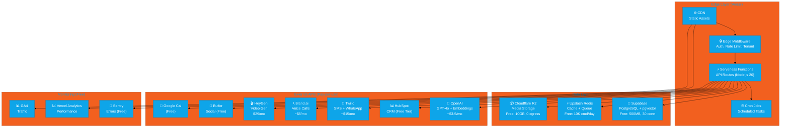

```mermaid
%%{init: {'theme': 'base', 'themeVariables': {'primaryColor': '#0EA5E9', 'primaryTextColor': '#fff'}}}%%

graph TB
    subgraph "Edge Layer (Vercel)"
        CDN["🌐 CDN<br/>Static Assets"]
        EMW["🔒 Edge Middleware<br/>Auth, Rate Limit, Tenant"]
        SF["⚡ Serverless Functions<br/>API Routes (Node.js 20)"]
        CRON["⏰ Cron Jobs<br/>Scheduled Tasks"]
    end

    subgraph "Data Layer"
        SUP["🐘 Supabase<br/>PostgreSQL + pgvector<br/>Free: 500MB, 30 conn"]
        UPS["⚡ Upstash Redis<br/>Cache + Queue<br/>Free: 10K cmd/day"]
        R2["📦 Cloudflare R2<br/>Media Storage<br/>Free: 10GB, 0 egress"]
    end

    subgraph "External APIs (Pay-per-use)"
        OAI["🧠 OpenAI<br/>GPT-4o + Embeddings<br/>~$3-5/mo"]
        HSP["📊 HubSpot<br/>CRM (Free Tier)"]
        TWI["📱 Twilio<br/>SMS + WhatsApp<br/>~$15/mo"]
        BLA["📞 Bland.ai<br/>Voice Calls<br/>~$8/mo"]
        HEY["🎬 HeyGen<br/>Video Gen<br/>$29/mo"]
        BUF["📢 Buffer<br/>Social (Free)"]
        GCAL["📅 Google Cal<br/>(Free)"]
    end

    subgraph "Monitoring (Free)"
        SEN["🐛 Sentry<br/>Errors (Free)"]
        VA["📈 Vercel Analytics<br/>Performance"]
        GA["📊 GA4<br/>Traffic"]
    end

    CDN --> EMW
    EMW --> SF
    SF --> CRON

    SF --> SUP
    SF --> UPS
    SF --> R2

    SF --> OAI
    SF --> HSP
    SF --> TWI
    SF --> BLA
    SF --> HEY
    SF --> BUF
    SF --> GCAL

    SF --> SEN
    CDN --> VA
    CDN --> GA
```