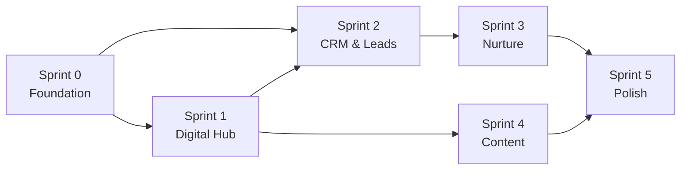

```mermaid
graph LR
    S0["Sprint 0<br/>Foundation"] --> S1["Sprint 1<br/>Digital Hub"]
    S0 --> S2["Sprint 2<br/>CRM & Leads"]
    S1 --> S2
    S2 --> S3["Sprint 3<br/>Nurture"]
    S1 --> S4["Sprint 4<br/>Content"]
    S3 --> S5["Sprint 5<br/>Polish"]
    S4 --> S5
```