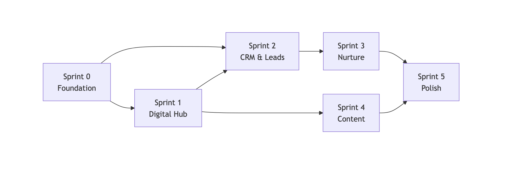

# Phased Implementation Plan — Overview

**Project**: The Autonomous Real Estate Agent  
**Version**: 1.0  
**Last Updated**: 2026-04-22

---

## 1. Sprint Overview

| Sprint | Phase | Duration | Working Days | Team | Key Deliverables |
|---|---|---|---|---|---|
| **Sprint 0** | Foundation | 3 days | 3 | Full-Stack + DevOps | Project init, DB, design system, CI/CD |
| **Sprint 1** | Phase 1: Digital Hub | 10 days | 10 | Full-Stack + AI/ML | Landing page, property pages, chatbot |
| **Sprint 2** | Phase 2: CRM & Leads | 7 days | 7 | Full-Stack + Backend | HubSpot integration, lead scoring, alerts |
| **Sprint 3** | Phase 3: Nurture | 8 days | 8 | Backend + AI/ML | Drip campaigns, voice agent, calendar |
| **Sprint 4** | Phase 4: Content | 8 days | 8 | Full-Stack + AI/ML | Content gen, video, social publishing |
| **Sprint 5** | Polish & Launch | 4 days | 4 | Full team | Testing, optimization, deployment |
| | **TOTAL** | **40 days** | **40** | | |

---

## 2. Sprint Timeline (Gantt)

```
Week 1   │ Week 2   │ Week 3   │ Week 4   │ Week 5   │ Week 6   │ Week 7   │ Week 8
─────────┼──────────┼──────────┼──────────┼──────────┼──────────┼──────────┼──────────
S0 ███   │          │          │          │          │          │          │
         │ S1 ██████████████████████████  │          │          │          │
         │          │          │          │ S2 ███████████████  │          │
         │          │          │          │          │          │ S3 ██████████████████
         │          │          │          │          │          │          │ (cont.)
─────────┴──────────┴──────────┴──────────┴──────────┴──────────┴──────────┴──────────

Week 9   │ Week 10
─────────┼──────────
S3 (end) │
S4 ██████████████████
         │ S5 ████
```

---

## 3. Sprint Dependencies



**Critical Path**: S0 → S1 → S2 → S3 → S5

**Parallel Work**: Sprint 4 (Content Factory) can begin after Sprint 1 is complete, independent of Sprint 2/3. With 2+ developers, Sprints 2+4 or 3+4 can overlap.

---

## 4. Definition of Done (per Sprint)

Each sprint is considered complete when:

- [ ] All tasks in the sprint backlog are implemented
- [ ] Unit tests pass (`npm run test`)
- [ ] Type checking passes (`npx tsc --noEmit`)
- [ ] Lint passes (`npm run lint`)
- [ ] Feature is deployed to Vercel preview
- [ ] Manual smoke test completed
- [ ] README/docs updated if applicable
- [ ] Code reviewed and merged to `main`

---

## 5. Sprint Detail Documents

| Sprint | Document |
|---|---|
| Sprint 0 | [sprint-0-foundation.md](sprint-0-foundation.md) |
| Sprint 1 | [sprint-1-phase1-digital-hub.md](sprint-1-phase1-digital-hub.md) |
| Sprint 2 | [sprint-2-phase2-crm.md](sprint-2-phase2-crm.md) |
| Sprint 3 | [sprint-3-phase3-nurture.md](sprint-3-phase3-nurture.md) |
| Sprint 4 | [sprint-4-phase4-content.md](sprint-4-phase4-content.md) |

---

## 6. Risk Buffer

Each sprint includes a **15% buffer** for:
- Integration debugging
- API authentication issues  
- Unexpected third-party rate limits or breaking changes
- UI/UX iteration based on stakeholder feedback

**Total calendar time with buffer**: 40 days × 1.15 = **~46 working days (9.2 weeks)**
