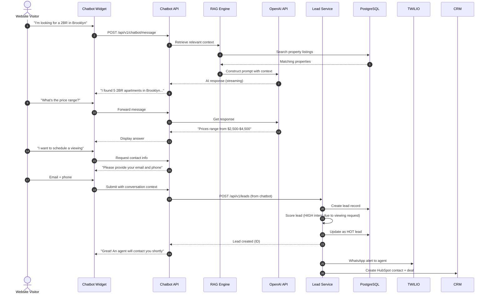

```mermaid
sequenceDiagram
    autonumber
    actor User as Website Visitor
    participant Chat as Chatbot Widget
    participant API as Chatbot API
    participant RAG as RAG Engine
    participant OpenAI as OpenAI API
    participant LS as Lead Service
    participant DB as PostgreSQL

    User->>Chat: "I'm looking for a 2BR in Brooklyn"
    Chat->>API: POST /api/v1/chatbot/message
    API->>RAG: Retrieve relevant context
    RAG->>DB: Search property listings
    DB-->>RAG: Matching properties
    RAG->>OpenAI: Construct prompt with context
    OpenAI-->>API: AI response (streaming)
    API-->>Chat: "I found 5 2BR apartments in Brooklyn..."

    %% Lead Qualification Questions
    User->>Chat: "What's the price range?"
    Chat->>API: Forward message
    API->>OpenAI: Get response
    OpenAI-->>API: "Prices range from $2,500-$4,500"
    API-->>Chat: Display answer

    %% Capture Lead Info
    User->>Chat: "I want to schedule a viewing"
    Chat->>API: Request contact info
    API-->>Chat: "Please provide your email and phone"

    User->>Chat: Email + phone
    Chat->>API: Submit with conversation context
    API->>LS: POST /api/v1/leads (from chatbot)
    LS->>DB: Create lead record
    LS->>LS: Score lead (HIGH intent due to viewing request)
    LS->>DB: Update as HOT lead
    LS-->>API: Lead created (ID)
    API-->>Chat: "Great! An agent will contact you shortly"

    %% Trigger Alert
    LS->>TWILIO: WhatsApp alert to agent
    LS->>CRM: Create HubSpot contact + deal
```