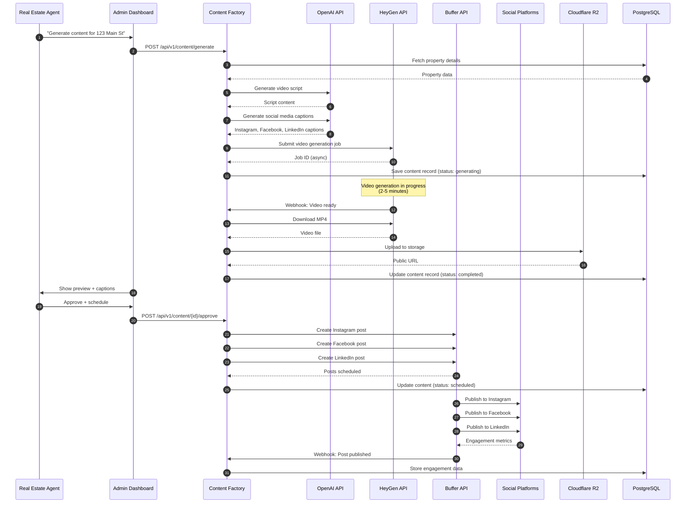

```mermaid
sequenceDiagram
    autonumber
    participant Agent as Real Estate Agent
    participant Dashboard as Admin Dashboard
    participant CF as Content Factory
    participant OpenAI as OpenAI API
    participant HeyGen as HeyGen API
    participant Buffer as Buffer API
    participant Social as Social Platforms
    participant R2 as Cloudflare R2
    participant DB as PostgreSQL

    %% Agent Initiates Content Generation
    Agent->>Dashboard: "Generate content for 123 Main St"
    Dashboard->>CF: POST /api/v1/content/generate
    CF->>DB: Fetch property details
    DB-->>CF: Property data

    %% Generate Script
    CF->>OpenAI: Generate video script
    OpenAI-->>CF: Script content
    CF->>OpenAI: Generate social media captions
    OpenAI-->>CF: Instagram, Facebook, LinkedIn captions

    %% Generate Video (Async)
    CF->>HeyGen: Submit video generation job
    HeyGen-->>CF: Job ID (async)
    CF->>DB: Save content record (status: generating)

    note over HeyGen: Video generation in progress<br/>(2-5 minutes)

    HeyGen->>CF: Webhook: Video ready
    CF->>HeyGen: Download MP4
    HeyGen-->>CF: Video file
    CF->>R2: Upload to storage
    R2-->>CF: Public URL
    CF->>DB: Update content record (status: completed)

    %% Agent Approval
    Dashboard->>Agent: Show preview + captions
    Agent->>Dashboard: Approve + schedule
    Dashboard->>CF: POST /api/v1/content/{id}/approve

    %% Schedule Social Posts
    CF->>Buffer: Create Instagram post
    CF->>Buffer: Create Facebook post
    CF->>Buffer: Create LinkedIn post
    Buffer-->>CF: Posts scheduled
    CF->>DB: Update content (status: scheduled)

    %% Publishing (at scheduled time)
    Buffer->>Social: Publish to Instagram
    Buffer->>Social: Publish to Facebook
    Buffer->>Social: Publish to LinkedIn
    Social-->>Buffer: Engagement metrics
    Buffer->>CF: Webhook: Post published
    CF->>DB: Store engagement data
```