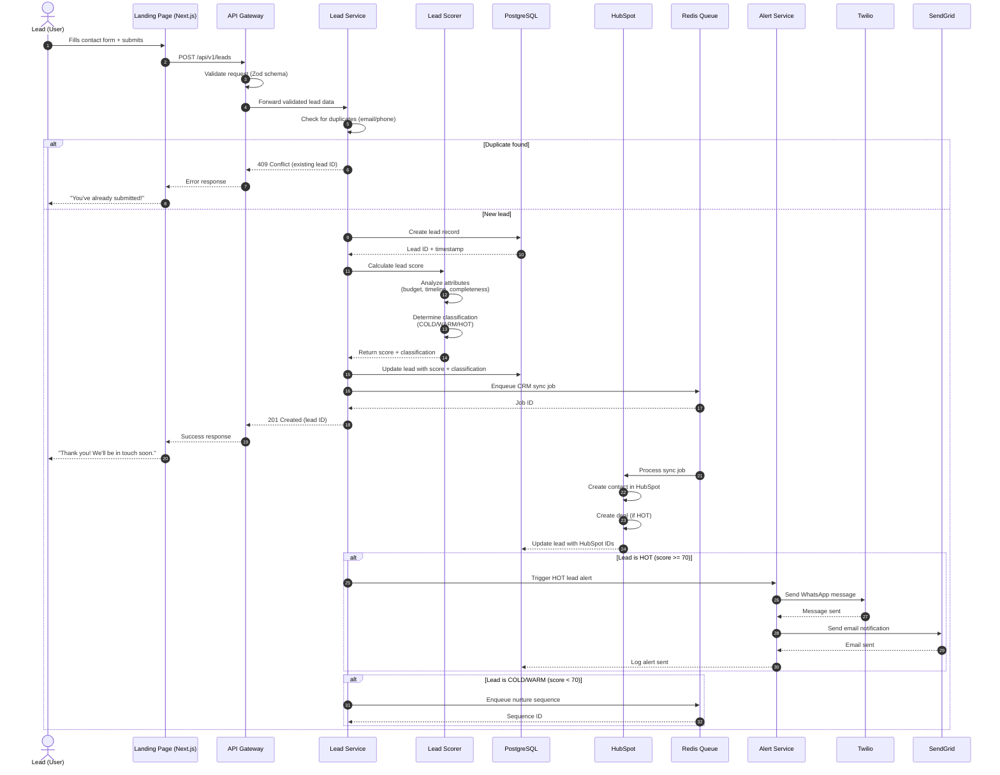

```mermaid
sequenceDiagram
    autonumber
    actor User as Lead (User)
    participant FE as Landing Page (Next.js)
    participant API as API Gateway
    participant LS as Lead Service
    participant SCORER as Lead Scorer
    participant DB as PostgreSQL
    participant CRM as HubSpot
    participant QUEUE as Redis Queue
    participant ALERT as Alert Service
    participant TWILIO as Twilio
    participant SENDGRID as SendGrid

    %% Lead Submission
    User->>FE: Fills contact form + submits
    FE->>API: POST /api/v1/leads
    API->>API: Validate request (Zod schema)
    API->>LS: Forward validated lead data

    %% Lead Processing
    LS->>LS: Check for duplicates (email/phone)
    alt Duplicate found
        LS-->>API: 409 Conflict (existing lead ID)
        API-->>FE: Error response
        FE-->>User: "You've already submitted!"
    else New lead
        LS->>DB: Create lead record
        DB-->>LS: Lead ID + timestamp

        %% Lead Scoring
        LS->>SCORER: Calculate lead score
        SCORER->>SCORER: Analyze attributes<br/>(budget, timeline, completeness)
        SCORER->>SCORER: Determine classification<br/>(COLD/WARM/HOT)
        SCORER-->>LS: Return score + classification
        LS->>DB: Update lead with score + classification

        %% CRM Sync (Async)
        LS->>QUEUE: Enqueue CRM sync job
        QUEUE-->>LS: Job ID

        %% Response to User
        LS-->>API: 201 Created (lead ID)
        API-->>FE: Success response
        FE-->>User: "Thank you! We'll be in touch soon."

        %% Background: CRM Sync
        QUEUE->>CRM: Process sync job
        CRM->>CRM: Create contact in HubSpot
        CRM->>CRM: Create deal (if HOT)
        CRM-->>DB: Update lead with HubSpot IDs

        %% Background: Alert (if HOT)
        alt Lead is HOT (score >= 70)
            LS->>ALERT: Trigger HOT lead alert
            ALERT->>TWILIO: Send WhatsApp message
            TWILIO-->>ALERT: Message sent
            ALERT->>SENDGRID: Send email notification
            SENDGRID-->>ALERT: Email sent
            ALERT-->>DB: Log alert sent
        end

        %% Background: Nurture Sequence (if not HOT)
        alt Lead is COLD/WARM (score < 70)
            LS->>QUEUE: Enqueue nurture sequence
            QUEUE-->>LS: Sequence ID
        end
    end
```