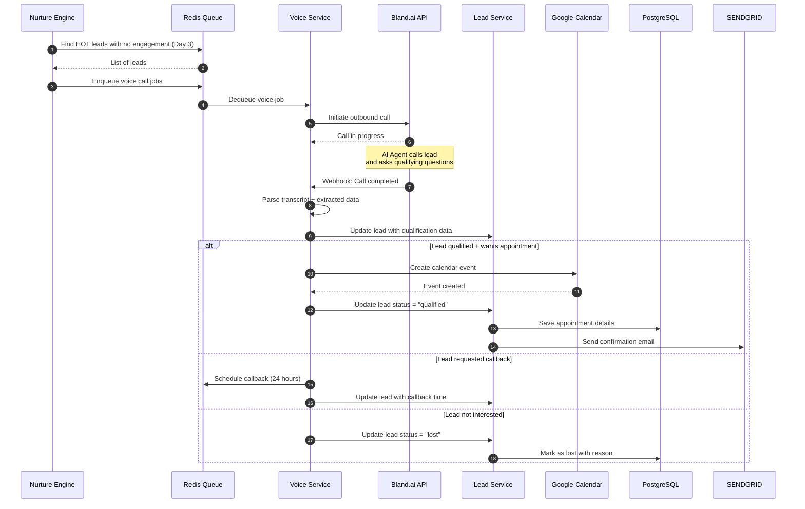

```mermaid
sequenceDiagram
    autonumber
    participant Nurture as Nurture Engine
    participant Queue as Redis Queue
    participant Voice as Voice Service
    participant Bland as Bland.ai API
    participant LS as Lead Service
    participant Calendar as Google Calendar
    participant DB as PostgreSQL

    %% Trigger: Non-engaged HOT lead after 3 days
    Nurture->>Queue: Find HOT leads with no engagement (Day 3)
    Queue-->>Nurture: List of leads
    Nurture->>Queue: Enqueue voice call jobs

    %% Process Voice Call
    Queue->>Voice: Dequeue voice job
    Voice->>Bland: Initiate outbound call
    Bland-->>Voice: Call in progress

    note over Bland: AI Agent calls lead<br/>and asks qualifying questions

    Bland->>Voice: Webhook: Call completed
    Voice->>Voice: Parse transcript + extracted data
    Voice->>LS: Update lead with qualification data

    alt Lead qualified + wants appointment
        Voice->>Calendar: Create calendar event
        Calendar-->>Voice: Event created
        Voice->>LS: Update lead status = "qualified"
        LS->>DB: Save appointment details
        LS->>SENDGRID: Send confirmation email
    else Lead requested callback
        Voice->>Queue: Schedule callback (24 hours)
        Voice->>LS: Update lead with callback time
    else Lead not interested
        Voice->>LS: Update lead status = "lost"
        LS->>DB: Mark as lost with reason
    end
```