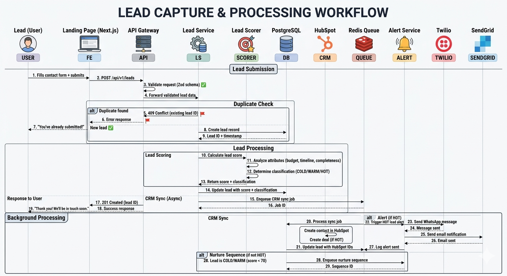
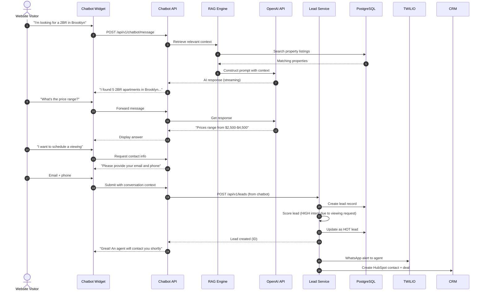
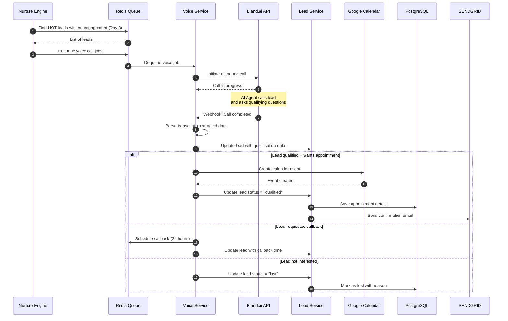
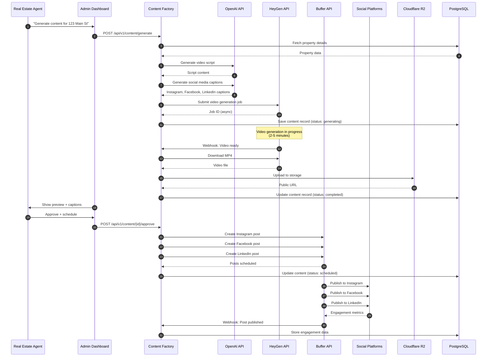

# Lead Capture Sequence Diagram

## Scenario: New Lead Submission from Landing Page

This sequence diagram shows the complete flow when a new lead submits their information through the landing page contact form.

> See diagram: [sequence-lead-capture.md](diagrams/new-lead-submission-from-landing-page.md)

---

## Scenario: Chatbot Lead Capture

---

## Scenario: Voice Call Qualification

---

## Scenario: Content Generation and Publishing

---

## Key Patterns

### 1. Async Processing with Queues
- All heavy operations (CRM sync, content gen, voice calls) are queued
- Redis Queue (BullMQ) ensures reliability with retry logic
- Webhook handlers return immediately, processing happens async

### 2. Circuit Breakers
- Each integration has a circuit breaker
- After 3 consecutive failures, integration auto-disables
- Background job retries with exponential backoff

### 3. Idempotency
- All webhook handlers are idempotent (safe to retry)
- Duplicate lead submissions return existing lead ID
- CRM sync jobs check if already synced

### 4. Event-Driven Updates
- Lead events trigger multiple downstream actions
- Hot lead → alert + nurture pause + CRM deal creation
- Engagement events → lead score recalculation + nurture adjustment
