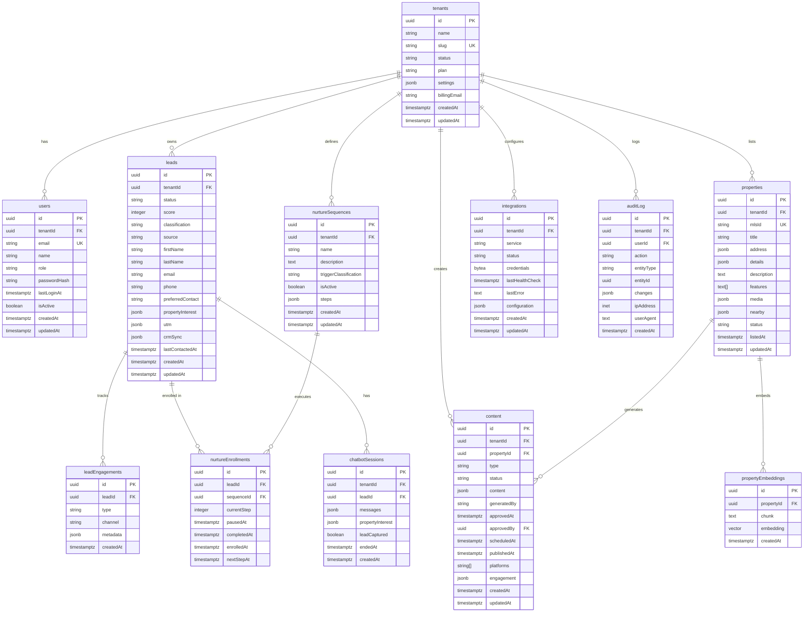

# Database Entity Relationship Diagram

## Complete Schema



---

## Key Relationships

### Tenant Multi-Tenancy
```
tenants (1) ──< (N) users
tenants (1) ──< (N) leads
tenants (1) ──< (N) properties
tenants (1) ──< (N) content
tenants (1) ──< (N) nurtureSequences
tenants (1) ──< (N) integrations
tenants (1) ──< (N) auditLog
```

### Lead Funnel
```
leads (1) ──< (N) leadEngagements
leads (1) ──< (N) nurtureEnrollments
leads (1) ──< (N) chatbotSessions
```

### Content Pipeline
```
properties (1) ──< (N) content
properties (1) ──< (N) propertyEmbeddings
```

### Nurture Automation
```
nurtureSequences (1) ──< (N) nurtureEnrollments
```

---

## Indexes Summary

### Performance Indexes
- `leads`: tenantId + status, email, phone, score, classification, createdAt
- `leadEngagements`: leadId, type, createdAt
- `properties`: mlsId, tenantId + status, details (GIN), address (GIN)
- `content`: tenantId + status, propertyId, scheduledAt, type
- `chatbotSessions`: tenantId, leadId, createdAt
- `nurtureEnrollments`: leadId, nextStepAt, sequenceId
- `propertyEmbeddings`: propertyId, embedding (HNSW)

### Security Indexes
- `users`: email (unique)
- `tenants`: slug (unique)
- `integrations`: tenantId + service (unique)

### Analytics Indexes
- `auditLog`: tenantId, userId, entityType + entityId, createdAt
- `leadEngagements`: leadId + createdAt (time-series)

---

## Data Volume Estimates

### Per Tenant (Monthly)
- **Leads**: 50-100 new leads
- **LeadEngagements**: 500-1,000 records (10 per lead)
- **ChatbotSessions**: 200-300 sessions
- **Properties**: 10-20 active listings
- **Content**: 20-30 pieces generated

### Multi-Tenant Scale (100 Tenants, Monthly)
- **Leads**: 5,000-10,000 new rows
- **LeadEngagements**: 50,000-100,000 new rows
- **ChatbotSessions**: 20,000-30,000 new rows
- **Properties**: 1,000-2,000 rows
- **Content**: 2,000-3,000 rows

### Database Growth (Year 1)
- **Estimated total rows**: ~1.5M rows
- **Estimated storage**: ~5-10GB (includes indexes)
- **Recommended backup**: Weekly + daily incremental
